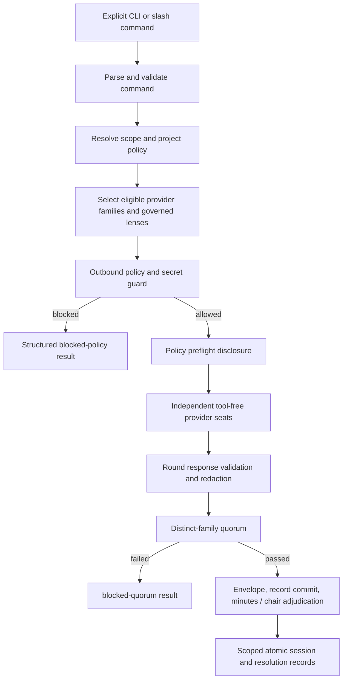

# Architecture

## Runtime boundary

`dist/cli.js` is the only installed runtime entry point. It is a self-contained Bun bundle and must run with `bun --no-install`; source files and `node_modules` are development inputs, not cache-time dependencies. Plugin commands contain prose and CLI invocation only.

No hook or repository-controlled file can start a council automatically.



## Substrate and modes

`src/substrate/` is everything a mode needs and nothing a mode decides: seats and lenses
(`roles/`, `models/`), transports and provider adapters (`execution/`, `providers/`), policy and
secrets (`policy/`, `evidence/`), records (`records/`), health (`health/`), the execution
patterns (`patterns/`), the spend ledger (`spend.ts`), the result envelope (`envelope.ts`) and
the session helpers (`session.ts`). Its only public entry is `src/substrate/index.ts`.

`src/modes/` is a registry of `ModeDefinition`s. A mode declares the five knobs from
`docs/vision.md`, its execution pattern, its defaults, its spend policy, how it prepares a
session (the committee's health preflight lives here) and the shape of its `output` block.
`committee` and `second-opinion` are registered; `docs/modes.md` specifies the rest.

`src/cli.ts` parses flags, resolves the mode for the command, builds the envelope, persists the
session and prints. `tests/core/dependency-direction.test.ts` enforces that modes reach the
substrate only through its index, that the substrate never imports a mode or the CLI, and that no
mode imports another.

## Result envelope

Every executed run returns one `ResultEnvelope` (`src/substrate/envelope.ts`), validated before it
is printed or stored: mode, session, declared caller, pattern, rounds, one entry per seat with
verified identity and the transport that answered, the mode's `output`, attributed synthesis and
dissent (both `null` until the synthesis brief), a unanimity flag to be suspicious of, spend,
`degraded` reasons and the record location. The same object is embedded in the session record.

## Spend

A mode's spend policy is `capped` or `never-metered`. `never-metered` pins `sub-only`. `capped`
takes a per-session cap on metered fallback calls (`--spend-cap`, default seats × rounds, which is
the historical behaviour of one metered retry per seat per round). The cap is enforced inside the
credential fallback wrapper, so a refused metered call shows as a `spend-cap` seat failure and the
envelope reports `stoppedAtCap` with a non-zero exit.

The cap only ever governs `sub-first`, because that is the only billing mode where a fallback call
crosses credential paths at all: under `--billing api-only` every call is metered by deliberate
choice, `withCredentialFallback` is not reachable, and the cap does not apply, though
`envelope.spend.used` still reports the true metered count; under `sub-only` no metered call is
possible, so there is nothing for a cap to refuse.

A run that reaches the spend cap exits 4 even when its outcome is `completed`: the envelope carries
`spend-cap-reached` in `degraded` and `stoppedAtCap: true` in `spend`, and the CLI result adds a
top-level `spendWarning`. Exit 0 requires both an outcome of `completed` and an unreached cap.

## Records and memory

A terminal record is committed in the records repository before the run reports success, with
`--no-verify`, never pushed, and never into the kernel's own repository. If the records root is
not a Git work tree the envelope says `records-not-committed` with the reason. When
`COUNCIL_MINUTES_DIR` is set, a Markdown minutes file is rendered beside it for the vault's ingest.
The kernel never calls Atlas.

A run that has written and committed its record never fails afterwards. A commit that cannot
happen — the records root is not a Git work tree, a record path resolves outside that work tree,
or `git` itself errors — adds `records-not-committed: <reason>` to `degraded` rather than failing
the run; a minutes file that cannot be written adds `minutes-not-written: <reason>` to `degraded`
and sets `record.minutes` to `null`. Both leave the run reporting success. The records commit runs
`git` with `GIT_DIR`, `GIT_WORK_TREE`, `GIT_INDEX_FILE` and `GIT_OBJECT_DIRECTORY` stripped from
its environment, so an invocation from inside a Git hook, `git rebase -x` or `git bisect run`
cannot redirect it at a different repository, and every path comparison resolves symlinks first so
a symlinked records root is not mistaken for lying outside its own work tree. `adjudicate` commits
its ruling, resolution and ledger update the same way, reporting `records: { committed, commitSha
}` on success or `records: { committed: false, reason }` otherwise.

## Domain and policy

`src/domain/` owns strict Zod contracts for classification, model routes, lenses, manifests, seat responses, quorum and run-state transitions.

`src/policy/data-guard.ts` evaluates the complete outbound request before any adapter is called. It combines:

- the motion classification;
- project provider allowlists and per-provider ceilings;
- exact provider/model destinations;
- the full outbound payload;
- an optional run-bound, payload-hash-bound override.

Invalid or missing project policy, restricted data, an unknown provider, an exceeded ceiling or a high-confidence secret blocks transmission. Overrides cannot cover secret detection or unrestricted policy failures.

`src/policy/secrets.ts` uses deterministic high-confidence detectors. Redaction markers carry only a secret kind and an eight-character digest; raw secret values never enter errors, diagnostics or records.

## Evidence boundary

`src/evidence/schema.ts` admits four explicit source shapes:

- trusted local instruction;
- untrusted local instruction;
- untrusted repository evidence;
- untrusted public HTTPS evidence.

Only a host-authored local instruction can be trusted. Repository paths must be relative and web locators must be public HTTPS addresses. `normaliseEvidence` hashes original source content, redacts it and encloses every untrusted excerpt in a delimiter-safe `untrusted-evidence` envelope. Every seat receives the same rendered pack.

Evidence collection itself is read-only. It does not run repository code, shell commands, write tools or panel tools. Provider seats receive no tools.

## Provider execution

`src/providers/index.ts` constructs one adapter per governed provider family:

| Family    | Transport                                                | Identity rule                                                                                                                                                                                                                                                                                                                                                                                                                                                                                                                                                                                                                                                                                                                                                                                               |
| --------- | -------------------------------------------------------- | ----------------------------------------------------------------------------------------------------------------------------------------------------------------------------------------------------------------------------------------------------------------------------------------------------------------------------------------------------------------------------------------------------------------------------------------------------------------------------------------------------------------------------------------------------------------------------------------------------------------------------------------------------------------------------------------------------------------------------------------------------------------------------------------------------------- |
| Anthropic | isolated local CLI                                       | trusted absolute executable; tool-free, stateless argv                                                                                                                                                                                                                                                                                                                                                                                                                                                                                                                                                                                                                                                                                                                                                      |
| OpenAI    | isolated local CLI (`codex exec`)                        | trusted absolute executable; identity and reasoning effort bound from the renderer header, and a downgraded effort is rejected                                                                                                                                                                                                                                                                                                                                                                                                                                                                                                                                                                                                                                                                              |
| xAI       | isolated local CLI (`grok`), else HTTPS chat completions | resolved from observable facts, **subscription first** — a `grok` binary on `PATH` selects the subscription CLI; otherwise `COUNCIL_XAI_API_KEY` selects HTTPS and the reason states the call is billable; otherwise `unconfigured`. Only transports listed in the route's `transport`/`alternateTransports` are permitted; the runner and health probe reject any other. The CLI parser requires subscription evidence (`init.apiKeySource === "oauth"`), the read-only `plan` permission mode, one consistent model and session identity across the init frame, assistant frame and the terminal result's sole `modelUsage` key, and no tool-use event. Advertised tools/MCP/skills are tolerated because grok's auth and MCP config share `~/.grok`; `--disallowed-tools` removes the mutating built-ins |
| Google    | isolated local CLI (`agy`)                               | actual model version must be present in the stream-json `init` event                                                                                                                                                                                                                                                                                                                                                                                                                                                                                                                                                                                                                                                                                                                                        |
| DeepSeek  | HTTPS chat completions                                   | actual model must be present in the response                                                                                                                                                                                                                                                                                                                                                                                                                                                                                                                                                                                                                                                                                                                                                                |
| Moonshot  | HTTPS chat completions                                   | actual model must be present in the response                                                                                                                                                                                                                                                                                                                                                                                                                                                                                                                                                                                                                                                                                                                                                                |

HTTP retries are bounded and limited to retryable network, 429 and server failures. CLI execution has a hard deadline and terminates the process group on POSIX or the complete process tree on Windows. Provider arguments are explicit argv plus stdin; no shell wrapper constructs the request.

Fallbacks remain within one provider family and only use registry-approved selectors. Missing credentials produce `unconfigured`/`skipped` responses. A failure is never relabelled as another family.

Structured provider answers contain recommendation, evidence, assumptions, risks, uncertainty and a decisive test. Malformed answers fail the seat. Returned content is redacted before it reaches round state, output or persistence.

## Lenses, rounds and quorum

`src/roles/catalogue.json` is the governed generic lens catalogue. `selectLenses` applies motion domains, impact and contested status. Its standing coverage requires domain, maintainer, risk and contrarian categories, plus systems for architecture, infrastructure and performance motions. An explicitly reduced three-seat council deterministically retains domain, risk and contrarian; maintainer and conditional systems coverage yield. Four-or-more-seat selection is unchanged. `assignLenses` uses deterministic SHA-256 permutations plus minimum-cost matching against prior assignments to rotate lenses without random or time-based behaviour. A chair override must name the original and replacement lenses and persist its reason.

`CouncilRunner` executes all seats in a round concurrently and preserves canonical family/seat ordering in the result. Round one is blind analysis; round two is rebuttal; round three is optional refinement. Prior responses are carried as explicitly untrusted data.

Quorum counts successful distinct provider families across the run. Ordinary resolution needs three families. Significant resolution defaults to four families and a successful contrarian lens. `council --min-families 3` is an explicit weaker mode: the contrarian remains mandatory, and the reduced floor plus warning is carried by the manifest, console result and persisted session record. Failed quorum disables synthesis; the facade cannot convert it into consensus.

## Records and migration

`CouncilStore` separates:

```text
<root>/general/
<root>/projects/<project-id>/
```

Each scope has its own sessions, resolutions and ledger. Inputs are Zod-validated, identifiers are path-safe and writes use same-directory temporary files, fsync, atomic rename and a scoped cross-process lock. Every write method returns the paths it wrote, which is what the CLI commits. Duplicate run, motion and resolution identifiers fail. A project record cannot mutate general history or another project.

General-history migration is a two-step boundary:

1. `migrate-general plan` reads and hashes the source, classifies entries in memory and writes a reviewable plan. It does not mutate records.
2. `migrate-general apply` requires explicit approval tied to the exact plan hash, verifies the source hash, publishes a byte-identical archive first, then writes provenance-bearing destinations and a manifest.

Unresolved items or source drift fail closed.

## Health and offline verification

`health --json` probes exact routes and emits a secret-free baseline. Baseline comparison reports newly unavailable families, actual-model changes, configured-route changes and total outage.

`doctor --json` additionally reports endpoint/executable resolution, tool isolation, candidate successor warnings and remediation codes. Health output never retains environment values or raw provider output.

`self-check --json` is offline. It validates the bundled registry, provider family set and governed lens catalogue without constructing a request or probing a provider.
